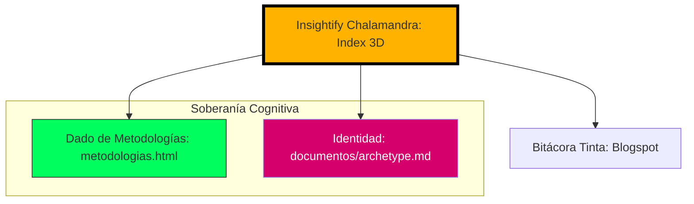

# Insightify Chalamandra | Magistral Pro

**Identidad: Búnker de Soberanía Cognitiva**

Insightify Chalamandra no es solo un proyecto de código; es una manifestación digital de la metodología **SRAP** (Scan, Ritmo, Análisis, Presencia). Este repositorio actúa como el sistema nervioso central para la decodificación estratégica, diseñado para transformar el caos en claridad absoluta para mentes del top 1%.

Nuestra misión es implementar una arquitectura de "IA Local First" que respete la privacidad absoluta (Zero-Egress) mientras potencia la capacidad humana para ver los hilos invisibles que mueven los mercados y las emociones.

## Arquitectura de Identidad

El siguiente diagrama ilustra el flujo de energía y navegación dentro del ecosistema digital de Chalamandra:

## Componentes del Ecosistema

*   **Index 3D (El Búnker)**: El punto de entrada visual. Una experiencia inmersiva que demuestra la transición del caos urbano a la estructura nodal organizada.
*   **Dado de Metodologías**: Un laboratorio táctico interactivo (`metodologias.html`) donde el azar y la intuición se encuentran con herramientas de introspección profunda.
*   **Identidad y Arquetipo**: Documentación viva (`documentos/archetype.md`) que define los principios inquebrantables de nuestra marca y filosofía.
*   **Bitácora Tinta**: La voz editorial que conecta la teoría con la práctica en el mundo real.

## Filosofía SRAP

1.  **S - Scan**: Escaneo profundo del entorno.
2.  **R - Ritmo**: Sincronización estratégica.
3.  **A - Análisis**: Decodificación de la raíz.
4.  **P - Presencia**: Impacto y ejecución.

---

*© 2026 Insightify Chalamandra. Magistral Pro.*
