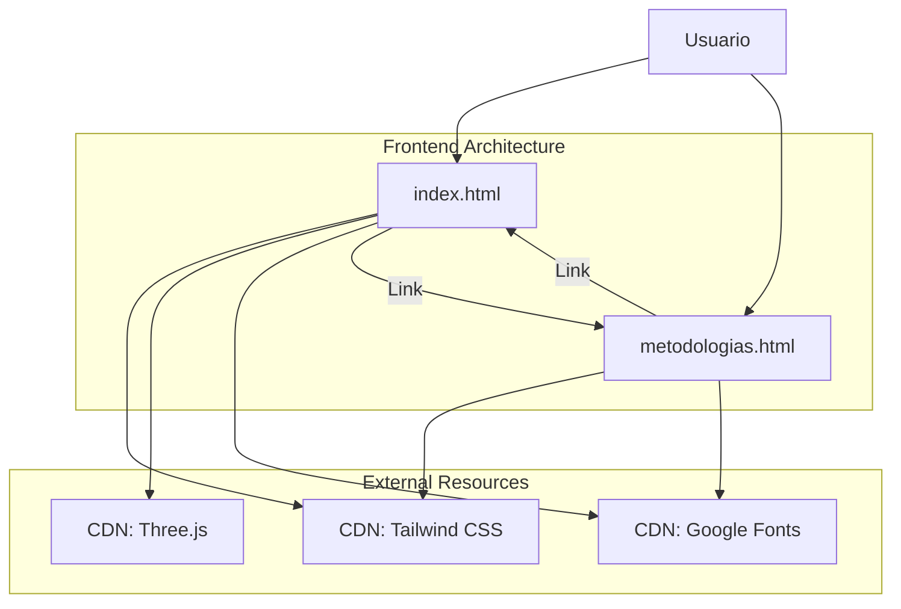

# Insightify Chalamandra | Magistral Pro

**Bunker of Cognitive Sovereignty**

Insightify Chalamandra implements the proprietary **SRAP** methodology (Scan, Rhythm, Analysis, Presence) to transform chaos into clarity. This project utilizes a **Local First** hybrid architecture, integrating local processing with the Google Gemini API to provide strategic decoding for the top 1% of minds.

## Project Architecture

The current architecture is a lightweight, frontend-focused stack that relies on CDNs for dependencies, ensuring a flat and simple structure.

## Key Components

*   **index.html**: The main entry point, featuring the 3D "Neural Hub" visualization and the SRAP framework presentation.
*   **metodologias.html**: A dedicated page for the "Dado Metodológico" and other interactive conceptual experiments.
*   **docs/**: Contains project documentation and brand identity guidelines.

## Methodologies

The core of the Insightify Chalamandra experience is the **SRAP Framework**:

1.  **Scan**: Deep reading of the market and emotional environment.
2.  **Ritmo (Rhythm)**: Synchronization with real speed.
3.  **Análisis (Analysis)**: Decoding the matrix.
4.  **Presencia (Presence)**: Surgical execution.

---

*© 2026 Insightify Chalamandra. All rights reserved.*
